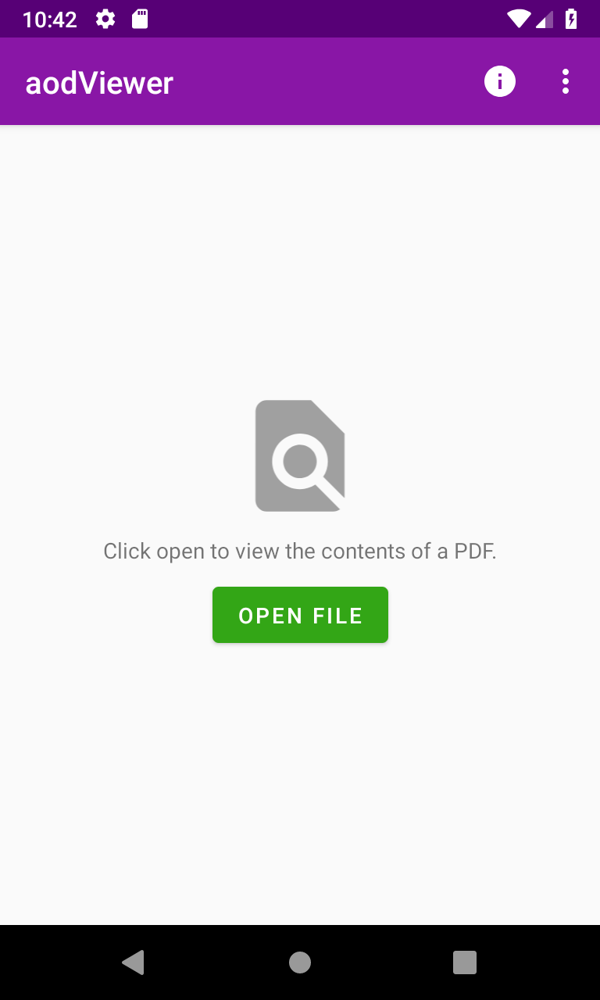
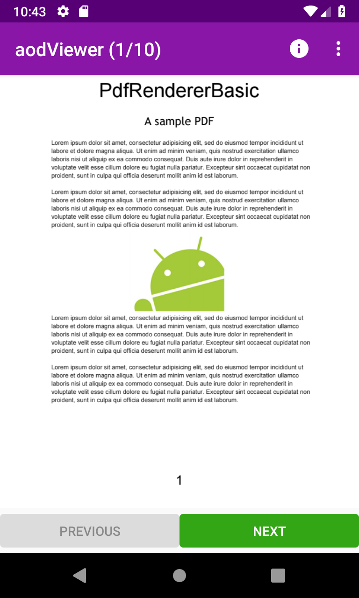

Android ACTION_OPEN_DOCUMENT Sample
========================================

This sample demonstrates how to display PDF document on screen using
the PdfRenderer introduced in [Android 5.0 Lollipop][4].

Introduction
------------

This sample demonstrates how to use the [Storage Access Framework][1] and
[`ACTION_OPEN_DOCUMENT`][2] to open PDF documents without relying on `READ_EXTERNAL_STORAGE`
permission.

The app also demonstrates how you can now render PDF document pages into bitmap images for printing
by using the [PdfRenderer][1] class introduced in Android Lollipop.

[1]: https://developer.android.com/guide/topics/providers/document-provider
[2]: https://developer.android.com/reference/android/content/Intent.html#ACTION_OPEN_DOCUMENT
[3]: https://developer.android.com/reference/android/graphics/pdf/PdfRenderer.html
[4]: https://www.android.com/versions/lollipop-5-0/

Pre-requisites
--------------

- Android SDK 28
- Android Device/Emulator API 21+

Screenshots
-------------

Getting Started
---------------

This sample uses the Gradle build system. To build this project, use the
"gradlew build" command or use "Import Project" in Android Studio.

Support
-------

- Stack Overflow: http://stackoverflow.com/questions/tagged/android

If you've found an error in this sample, please file an issue:
https://github.com/android/storage/issues

Patches are encouraged, and may be submitted by forking this project and
submitting a pull request through GitHub. Please see CONTRIBUTING.md for more details.

License
-------

Copyright 2017 The Android Open Source Project, Inc.

Licensed to the Apache Software Foundation (ASF) under one or more contributor
license agreements.  See the NOTICE file distributed with this work for
additional information regarding copyright ownership.  The ASF licenses this
file to you under the Apache License, Version 2.0 (the "License"); you may not
use this file except in compliance with the License.  You may obtain a copy of
the License at

http://www.apache.org/licenses/LICENSE-2.0

Unless required by applicable law or agreed to in writing, software
distributed under the License is distributed on an "AS IS" BASIS, WITHOUT
WARRANTIES OR CONDITIONS OF ANY KIND, either express or implied.  See the
License for the specific language governing permissions and limitations under
the License.
