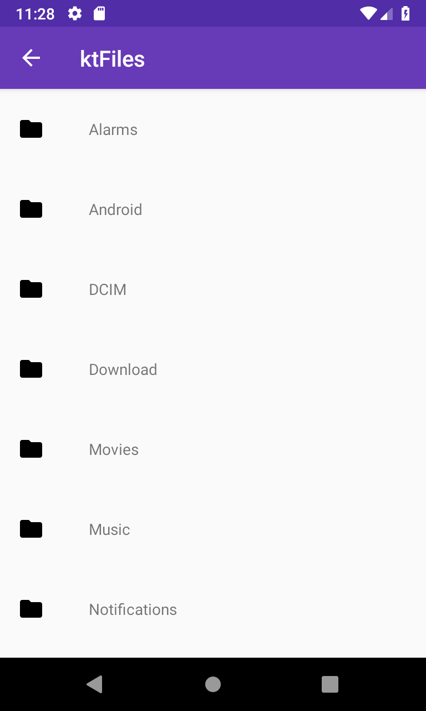

# Android ACTION_OPEN_DOCUMENT_TREE Sample

A proof of concept file manager utilizing the
[ACTION_OPEN_DOCUMENT_TREE](https://developer.android.com/reference/android/content/Intent.html#ACTION_OPEN_DOCUMENT_TREE)
intent introduced with [Android 5.0](https://www.android.com/versions/lollipop-5-0/), API level 21.

## Introduction

The [Storage Access Framework](https://developer.android.com/guide/topics/providers/document-provider)
was introduced in Android 4.4, API level 19, with the new Intents
[ACTION_OPEN_DOCUMENT](https://developer.android.com/reference/android/content/Intent.html#ACTION_OPEN_DOCUMENT)
and
[ACTION_CREATE_DOCUMENT](https://developer.android.com/reference/android/content/Intent.html#ACTION_CREATE_DOCUMENT).
This allowed an app to open or save files in a shared directory without additional permissions.

These APIs were then extended in Android 5.0 with the intent
[ACTION_OPEN_DOCUMENT_TREE](https://developer.android.com/reference/android/content/Intent.html#ACTION_OPEN_DOCUMENT_TREE).
This intent allowed the user to choose and grant access to an entire directory tree, including the
entire SD card which is ideal for folder based media players or file managers apps.

This sample provides a minimal proof of concept file manager called "ktFiles" which,
after granted access to a directory, allows the user to browse and open
any files found within the directories by utilizing common Android intents.

## ACTION_OPEN_DOCUMENT_TREE

An app can utilize the ACTION_OPEN_DOCUMENT_TREE intent by building an Intent and using
[`Activity. startActivityForResult `](https://developer.android.com/reference/android/app/Activity#startActivityForResult(android.content.Intent,%20int,%20android.os.Bundle))
to start the system document picker:

```kotlin
val intent = Intent(Intent.ACTION_OPEN_DOCUMENT_TREE)
startActivityForResult(intent, OPEN_DIRECTORY_REQUEST_CODE)
```

Your app will then receive the results of this in [`Activity.onActivityResult`](https://developer.android.com/reference/android/app/Activity.html#onActivityResult(int,%20int,%20android.content.Intent)).
The return can be handled like this:

```kotlin
override fun onActivityResult(requestCode: Int, resultCode: Int, data: Intent?) {
    super.onActivityResult(requestCode, resultCode, data)
    if (requestCode == OPEN_DIRECTORY_REQUEST_CODE) {
        if (resultCode == Activity.RESULT_OK) {
            val directoryUri = data?.data ?: return
            // Open with `DocumentFile.fromTreeUri`...
        } else {
            // The user cancelled the request.
        }
    }
}
```

## Pre-requisites

- Android SDK 28
- Android Studio 3.3+

## Screenshots



## Getting Started

This sample uses the Gradle build system. To build this project, use the
"gradlew build" command or use "Import Project" in Android Studio.

## Support

- Stack Overflow: http://stackoverflow.com/questions/tagged/android

If you've found an error in this sample, please file an issue:
https://github.com/googlesamples/android-DirectorySelection

Patches are encouraged, and may be submitted by forking this project and
submitting a pull request through GitHub. Please see CONTRIBUTING.md for more details.

License
-------

Copyright 2019 The Android Open Source Project, Inc.

Licensed to the Apache Software Foundation (ASF) under one or more contributor
license agreements.  See the NOTICE file distributed with this work for
additional information regarding copyright ownership.  The ASF licenses this
file to you under the Apache License, Version 2.0 (the "License"); you may not
use this file except in compliance with the License.  You may obtain a copy of
the License at

http://www.apache.org/licenses/LICENSE-2.0

Unless required by applicable law or agreed to in writing, software
distributed under the License is distributed on an "AS IS" BASIS, WITHOUT
WARRANTIES OR CONDITIONS OF ANY KIND, either express or implied.  See the
License for the specific language governing permissions and limitations under
the License.
