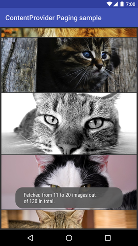

Android ContentProviderPaging Sample (Kotlin)
===================================

This sample demonstrates how to use the ContentProvider with paging support introduced
in Android O. The ContentProvider now accepts additional arguments for the offset and
the limit in the query method to support paging instead of fetching all the data in
a single query method call.

Introduction
------------

[ContentProvider][1] and [DocumentsProvider][2] now supports paging instead of fetching the all
data at once.

Starting from Android O, ContentProvider#query(Uri, String[], Bundle, CancellationSignal) and
DocumentsProvider#query(Uri, String[], Bundle, CancellationSignal) methods are introduced.
The Bundle accepts the keys for ContentResolver.QUERY_ARG_OFFSET as an starting offset and
ContentResolver.QUERY_ARG_LIMIT as the number of items included in the returned Cursor object.

Similarly, the returned Cursor object now has a Bundle object obtained by Cursor#getExtras().
The Bundle is able to include data such as the  total size of the underlying data set.

[1]: https://developer.android.com/reference/android/content/ContentProvider.html
[2]: https://developer.android.com/reference/android/provider/DocumentsProvider.html

Pre-requisites
--------------

- Android SDK 25
- Android Build Tools v25.0.3
- Android Support Repository

Screenshots
-------------

 

Getting Started
---------------

This sample uses the Gradle build system. To build this project, use the
"gradlew build" command or use "Import Project" in Android Studio.

Support
-------

- Google+ Community: https://plus.google.com/communities/105153134372062985968
- Stack Overflow: http://stackoverflow.com/questions/tagged/android

If you've found an error in this sample, please file an issue:
https://github.com/googlesamples/android-ContentProviderPaging

Patches are encouraged, and may be submitted by forking this project and
submitting a pull request through GitHub. Please see CONTRIBUTING.md for more details.

License
-------

Copyright 2017 The Android Open Source Project, Inc.

Licensed to the Apache Software Foundation (ASF) under one or more contributor
license agreements.  See the NOTICE file distributed with this work for
additional information regarding copyright ownership.  The ASF licenses this
file to you under the Apache License, Version 2.0 (the "License"); you may not
use this file except in compliance with the License.  You may obtain a copy of
the License at

http://www.apache.org/licenses/LICENSE-2.0

Unless required by applicable law or agreed to in writing, software
distributed under the License is distributed on an "AS IS" BASIS, WITHOUT
WARRANTIES OR CONDITIONS OF ANY KIND, either express or implied.  See the
License for the specific language governing permissions and limitations under
the License.
