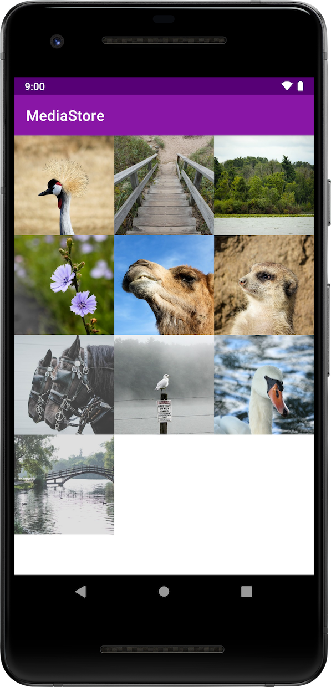

Android Media Store Sample
==========================

This sample demonstrates how to use Android's [MediaStore][4] to locate and display the users
images in a RecyclerView.

Introduction
------------

This sample demonstrates how to use the [Media Store][1] to display items in the
[Images][2] collection. This requires [`READ_EXTERNAL_STORAGE`][3] permission since it accesses
files that other apps created and contributed to the Media Store. 

Pre-requisites
--------------

- Android SDK 29
- Android Device/Emulator API 16+

Screenshots
-------------

Photos by [Hannah Troupe][4] on [Unsplash][5].

Getting Started
---------------

This sample uses the Gradle build system. To build this project, use the
"gradlew build" command or use "Import Project" in Android Studio.

Support
-------

- Stack Overflow: http://stackoverflow.com/questions/tagged/android

If you've found an error in this sample, please file an issue:
https://github.com/android/storage/issues

Patches are encouraged, and may be submitted by forking this project and
submitting a pull request through GitHub. Please see CONTRIBUTING.md for more details.

License
-------

Copyright 2019 The Android Open Source Project, Inc.

Licensed to the Apache Software Foundation (ASF) under one or more contributor
license agreements.  See the NOTICE file distributed with this work for
additional information regarding copyright ownership.  The ASF licenses this
file to you under the Apache License, Version 2.0 (the "License"); you may not
use this file except in compliance with the License.  You may obtain a copy of
the License at

http://www.apache.org/licenses/LICENSE-2.0

Unless required by applicable law or agreed to in writing, software
distributed under the License is distributed on an "AS IS" BASIS, WITHOUT
WARRANTIES OR CONDITIONS OF ANY KIND, either express or implied.  See the
License for the specific language governing permissions and limitations under
the License.

[1]: https://developer.android.com/reference/android/provider/MediaStore
[2]: https://developer.android.com/reference/android/provider/MediaStore.Images
[3]: https://developer.android.com/reference/android/Manifest.permission.html#READ_EXTERNAL_STORAGE
[4]: https://developer.android.com/reference/android/provider/MediaStore
[5]: https://unsplash.com/@htroupe?utm_source=unsplash&utm_medium=referral&utm_content=creditCopyText