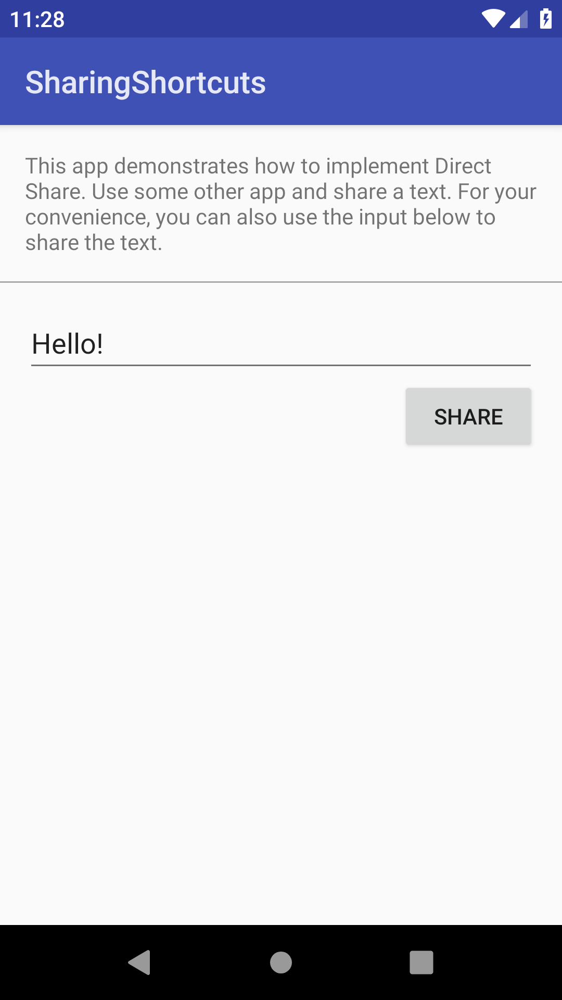
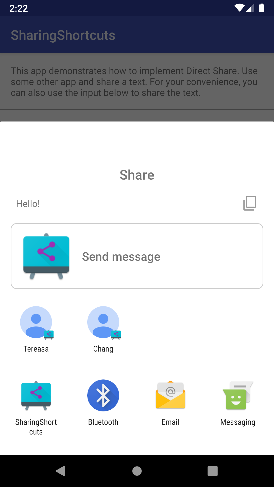
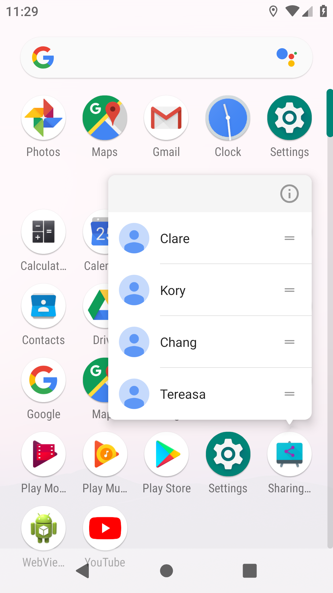

Android SharingShortcuts Sample
===================================

Sample demonstrating how to show some options directly in the list of share intent candidates.

Introduction
------------

Direct Share is a feature that allows apps to show their internal options directly in the
system Intent chooser dialog. This sample is a dummy messaging app, and just like any other
messaging apps, it receives intents for sharing a plain text. When a user shares some text from some
other app, this sample app will be listed as an option. Using the Direct Share feature, this app
also shows some of contacts directly in the chooser dialog.

Direct Share was [first introduced][1] in Android M where you had to implement a service to provide
direct share targets on demand. The way to do that changed in Android Q, you need to provide your
direct share targets in advance. First, you have to declare share-target elements in the same
application's resource file than [static shortcuts][2]. Then, you need to publish dynamic
shortcuts with the same category you declared in the share-target with the [ShortcutManager API][3].
You will need to manually update the list of shortcuts every time you consider it appropriate.
The API offers methods to update, remove or add shortcuts. You can use the
[ShortcutInfoCompat.Builder][4] to customize your shortcut. If you don't want to block the UI thread
doing these operations, interactions with the ShortcutManager can also happen on a background thread.

There are three ways the app is sending/receiving intents:
- Dynamic Share: The user selected the app in the sharesheet to receive the text. After this,
the user will have to select the contact to share the text with. In our case, the app receives an
intent of type Intent.ACTION_SEND.
- Direct Share: The user selected a person of your app in the sharesheet to share the text with.
The received intent of type Intent.ACTION_SEND will contain a String EXTRA_SHORTCUT_ID that will
have the id of the shortcut that was selected. After this, the app is ready to send the text.
- Launcher shortcut: When the user taps on a launcher shortcut, the intent that was
added to the shortcut will get fired. In our case, it triggers an intent of type Intent.ACTION_DEFAULT.

To make Direct Share backwards compatible with older Android versions, you need to add the AndroidX
sharetarget library and in your AndroidManifest.xml, add a meta-data tag in your Activity that
receives the Intent. Specify android:name as android.service.chooser.chooser_target_service and
android:value as androidx.sharetarget.ChooserTargetServiceCompat.

The way to share text has also changed. Before, you could specify a title in the
[Intent.createChooser()][5] method itself. That is deprecated and unused in Android Q. You can achieve
the same behavior by adding an Intent.EXTRA_TITLE extra to the intent. Similarly, if you want a
preview thumbnail to appear, you can create a content URI and set a ClipData object in the intent.
You can see how to do that in our example, open the MainActivity.java file for more details.

[1]: https://developer.android.com/about/versions/marshmallow/android-6.0#direct-share
[2]: https://developer.android.com/guide/topics/ui/shortcuts/creating-shortcuts
[3]: https://developer.android.com/reference/androidx/core/content/pm/ShortcutManagerCompat.html
[4]: https://developer.android.com/reference/androidx/core/content/pm/ShortcutInfoCompat.Builder.html
[5]: https://developer.android.com/reference/android/content/Intent.html#createChooser(android.content.Intent,%20java.lang.CharSequence)

Pre-requisites
--------------

- Android SDK 28
- Android Build Tools v28.0.3
- Android Support Repository

Screenshots
-------------

    

Getting Started
---------------

This sample uses the Gradle build system. To build this project, use the
"gradlew build" command or use "Import Project" in Android Studio.

Support
-------

- Stack Overflow: http://stackoverflow.com/questions/tagged/android

If you've found an error in this sample, please file an issue:
https://github.com/android/storage

Patches are encouraged, and may be submitted by forking this project and
submitting a pull request through GitHub. Please see CONTRIBUTING.md for more details.
