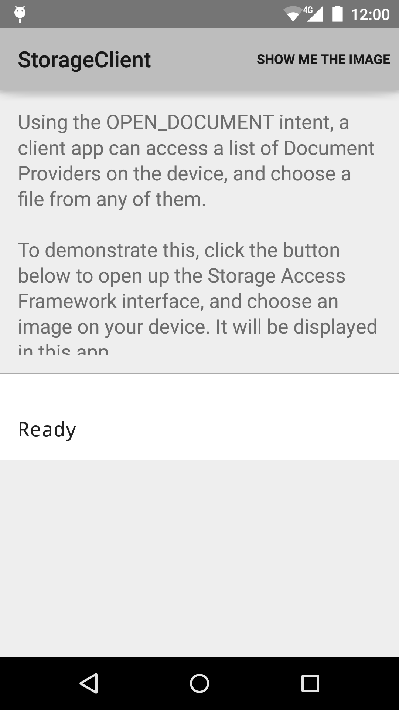

Android StorageClient Sample
===================================

Using the OPEN_DOCUMENT intent, a client app can access a list of Document Providers
on the device, and choose a file from any of them.

Introduction
------------

This sample aims to help you understand the OPEN_DOCUMENT intent, which allows a client
application to access a list of Document Providers on the devices and choose a file from
any of them.

This sample first fires an intent to spin up the "file chooser" UI and select an image.
Then, given the content:// URI of the selected image, it shows it on the screen using a
DialogFragment. It also grabs metadata for the document specified by URI and logs that to
the screen.

To demonstrate this, click the "Show me" button to open up the Storage Access Framework
interface, and choose an image on your device.  It will be displayed in this app.

Pre-requisites
--------------

- Android SDK 28
- Android Build Tools v28.0.3
- Android Support Repository

Screenshots
-------------

 

Getting Started
---------------

This sample uses the Gradle build system. To build this project, use the
"gradlew build" command or use "Import Project" in Android Studio.

Support
-------

- Stack Overflow: http://stackoverflow.com/questions/tagged/android

If you've found an error in this sample, please file an issue:
https://github.com/android/storage

Patches are encouraged, and may be submitted by forking this project and
submitting a pull request through GitHub. Please see CONTRIBUTING.md for more details.
