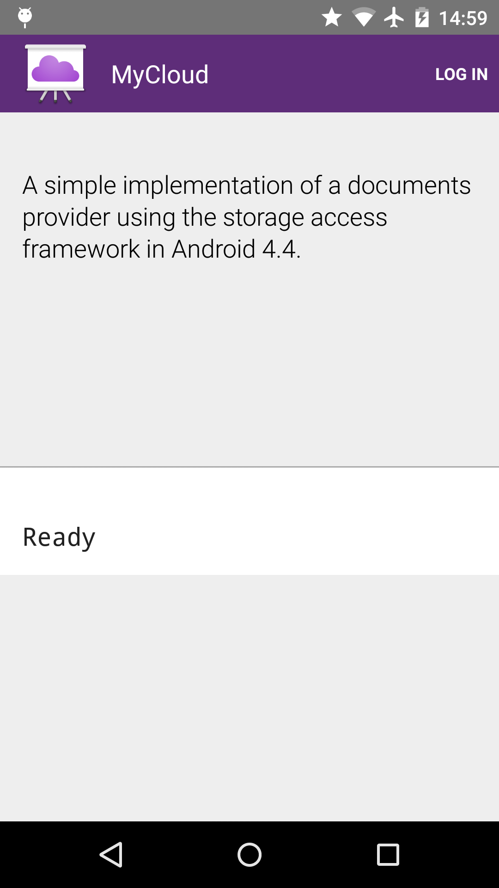
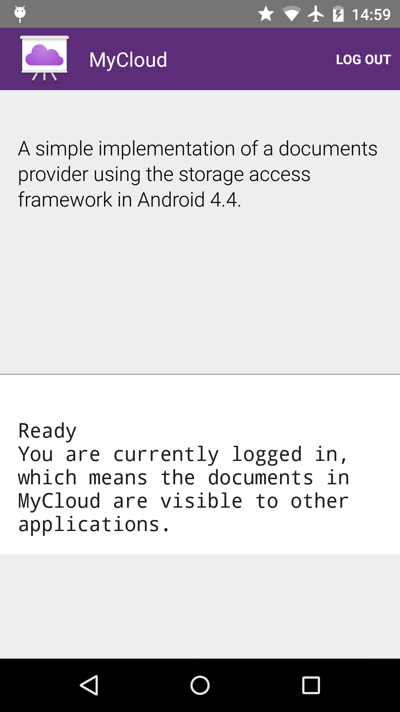

Android StorageProvider Sample
===================================

This sample shows how to implement a simple documents provider using the storage access
framework available in Android 4.4.

Introduction
------------

This sample uses the [StorageAccessFramework][1] introduced in Android 4.4 to implement a [DocumentsProvider][2].

See [Writing A Custom Document Provider guide][3] for all the details on how to do this.

[1]: https://developer.android.com/guide/topics/providers/document-provider.html
[2]: https://developer.android.com/reference/android/provider/DocumentsProvider.html
[3]: https://developer.android.com/guide/topics/providers/document-provider.html#custom

Pre-requisites
--------------

- Android SDK 28
- Android Build Tools v28.0.3
- Android Support Repository

Screenshots
-------------

  

Getting Started
---------------

This sample uses the Gradle build system. To build this project, use the
"gradlew build" command or use "Import Project" in Android Studio.

Support
-------

- Stack Overflow: http://stackoverflow.com/questions/tagged/android

If you've found an error in this sample, please file an issue:
https://github.com/android/storage

Patches are encouraged, and may be submitted by forking this project and
submitting a pull request through GitHub. Please see CONTRIBUTING.md for more details.
